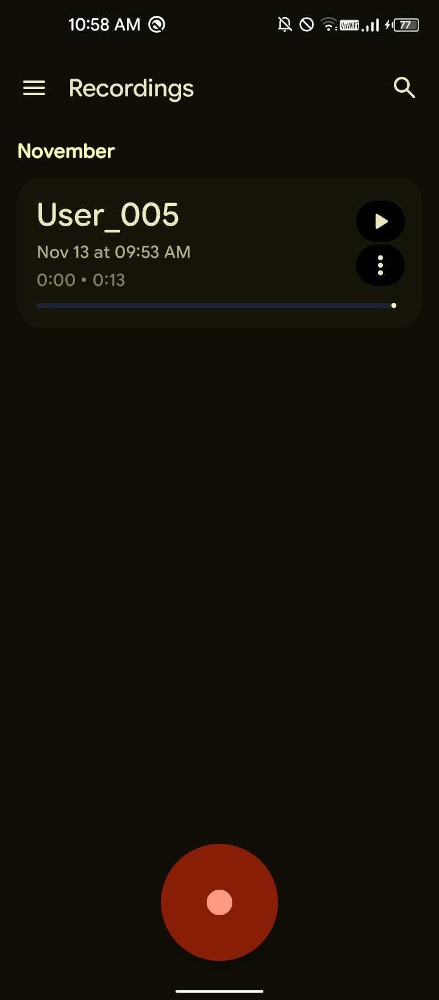
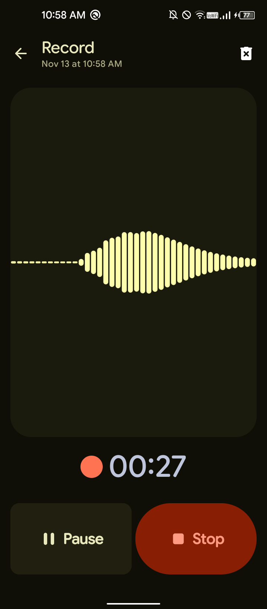
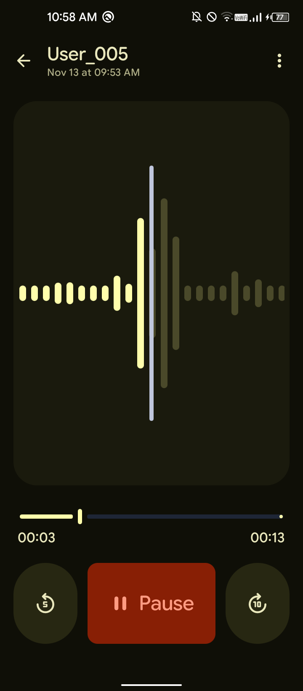

   

<h1 align="center">
   RecordMaster V1.5
</h1>

 

  

 

[Contact](https://github.com/PranshulGG/RecordMaster?tab=readme-ov-file#contact) • [License](https://github.com/PranshulGG/RecordMaster?tab=readme-ov-file#license)

 

       

   <h3>RecordMaster: inspired by the Google Pixel Recorder app</h3>

   

 
   

 

# 👁️ Screenshots

  
  
  

## New Changes

  
  

 

# 📝 Recent updates

- Added an Info action in the recording three-dot menu with a dialog that shows name, date, and location.
- Restyled the Info dialog to feel more Material 3 Expressive, with rounder subsections and smaller text so full paths show without truncation.
- Removed pause/resume snackbar notifications as they were redundant.
- Updated the save snackbar to show a user-friendly saved name.
- Open the keyboard automatically when tapping the search icon, keeping the UI aligned with Material 3 design principles.

# ✉️ Contact

For any questions or feedback, feel free to open an issue on GitHub or contact pranshul.devmain@gmail.com or syedmuhammadahmernaqvi@gmail.com

# ©️ License

This project is licensed under the GPL-3.0 license. See the `LICENSE` file for details.
